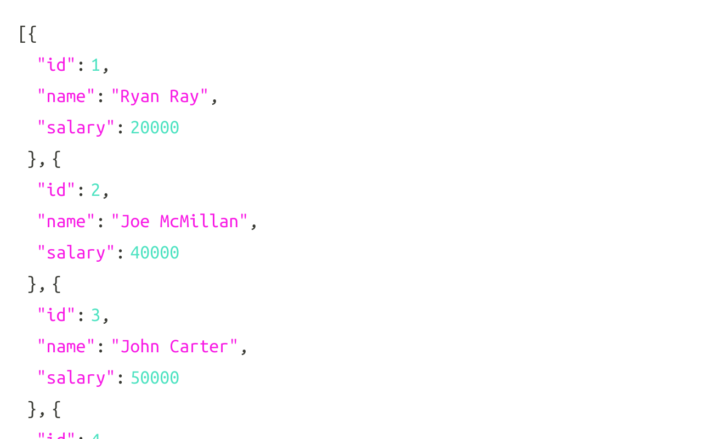

# mi Api Rest
En este proyecto, aprendi como usar una REST API con Nodejs y como gestor de base de datos MySQL, esto nos permite acceder a los datos desde cualquier otra aplicacion ya sea movil o web, en esta practica usamos una aplicacion llamada Postman: es una herramienta que se utiliza, sobre todo, para el testing de API REST , aunque también admite otras funcionalidades que se salen de lo que engloba el testing de este tipo de sistemas, esta aplicacion nos sirvio para consultar la pagina con localhos:3000 y nos diera los datos, tambien se pudo hacer consulta de un solo id, entre otras cosas.

## REST Api 
###¿Que es?
Buscando una definición sencilla, REST es cualquier interfaz entre sistemas que use HTTP para obtener datos o generar operaciones sobre esos datos en todos los formatos posibles, como XML y JSON.
Las operaciones más importantes relacionadas con los datos en cualquier sistema REST y la especificación HTTP son cuatro: POST (crear), GET (leer y consultar), PUT (editar) y DELETE (eliminar).
La API REST siempre es independiente del tipo de plataformas o lenguajes.

Resultado:

